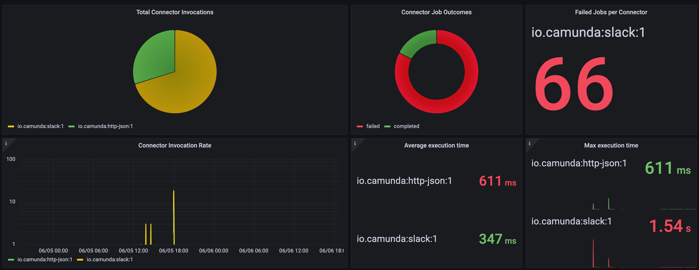
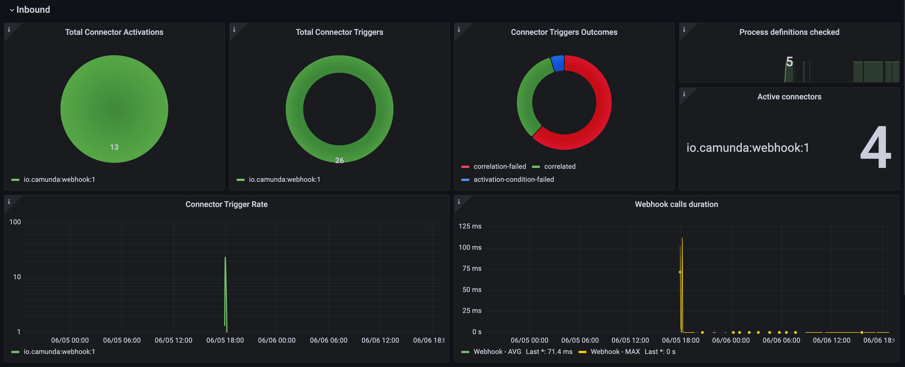
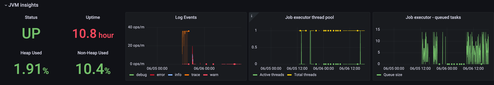

# Grafana dashboard for Camunda 8 Connector Runtime

This repository contains a Grafana dashboard for monitoring Camunda 8 Connector Runtime, as well
as a Docker Compose setup for running it locally.

## Prerequisites

- [Connector Runtime](https://github.com/camunda/connectors-bundle/tree/main/connector-runtime) is running

## Run the dashboard

```shell
docker-compose up
```

This will start Grafana and Prometheus containers and import the dashboard.

Prometheus is configured to scrape metrics from Connector Runtime at http://localhost:9080/metrics.
If you want to change the URL, update the [`prometheus.yml`](prometheus/prometheus.yml) file.

## Dashboard

The dashboard is available at http://localhost:3000/d/connectors-sm

### Outbound Connector metrics



- Connector invocation count by connector type
- Connector job outcomes
- Failed jobs by connector type
- Connector invocation rate
- Average & maximum connector execution time by connector type

### Inbound Connector metrics



- Connector activation and trigger count by connector type
- Connector trigger outcomes
- Number of process definitions checked
- Number of active connectors by connector type
- Connector trigger rate
- Webhook call duration

### Connector Runtime metrics



- Status (UP/DOWN)
- JVM memory usage
- Uptime
- Log events chart
- Job executor thread pool state chart
- Job executor queue size chart
